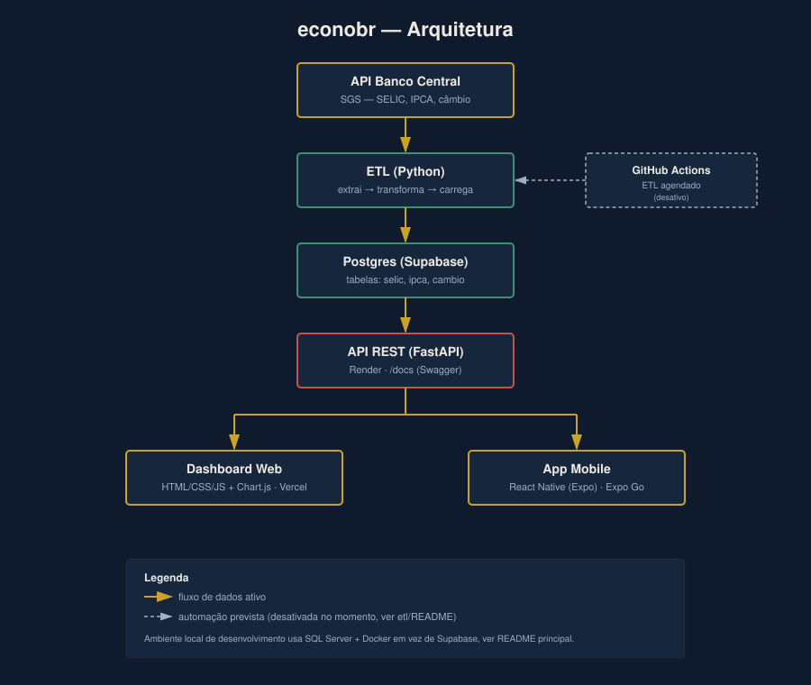
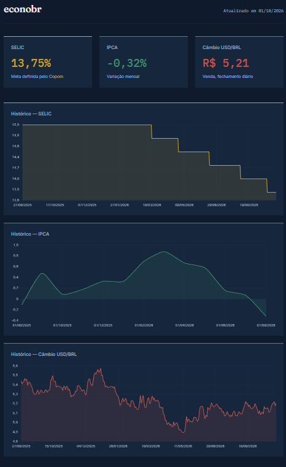
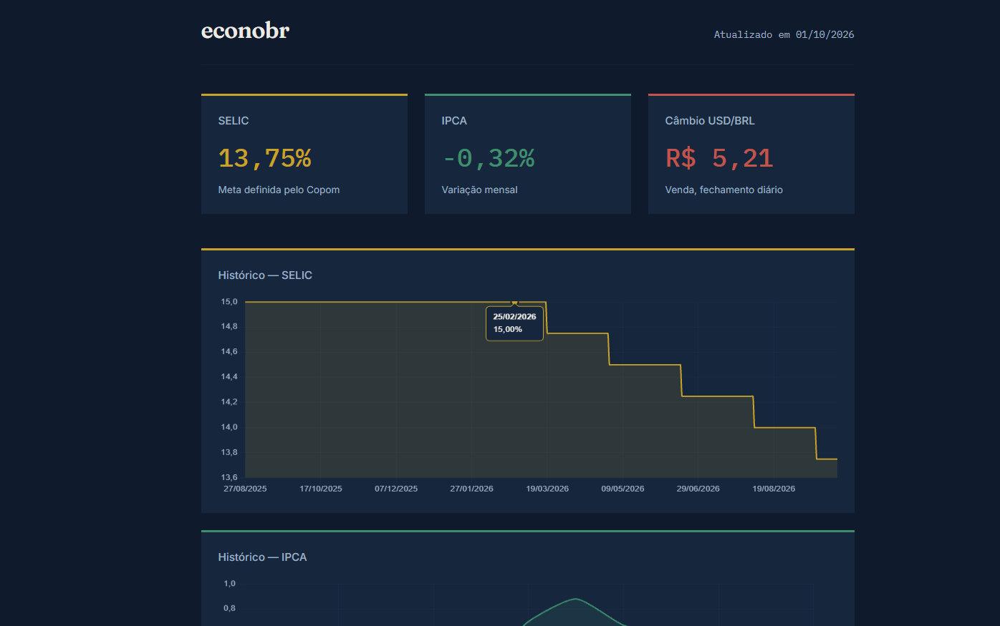
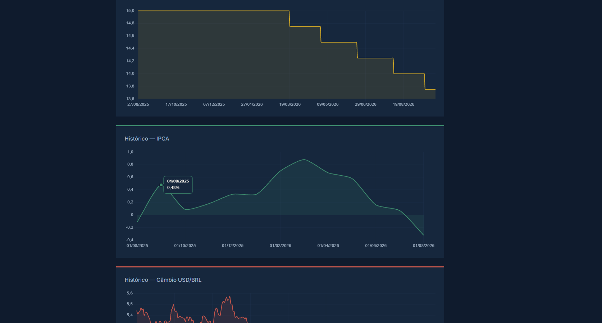
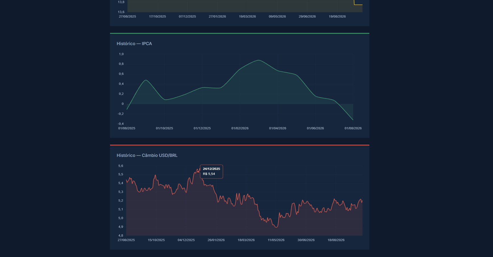
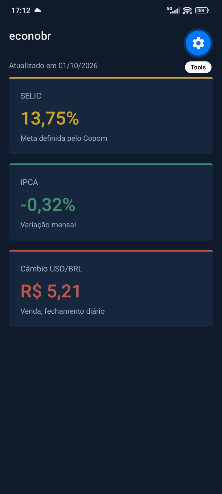
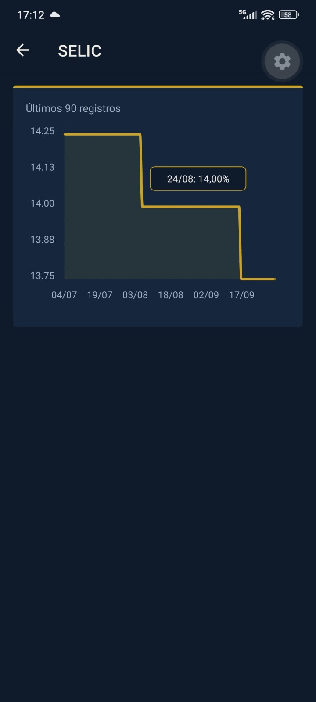
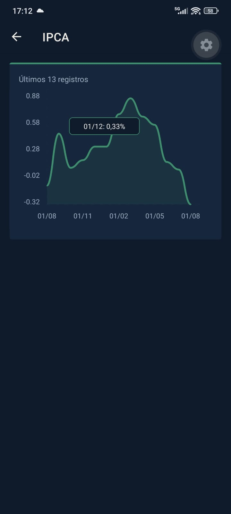
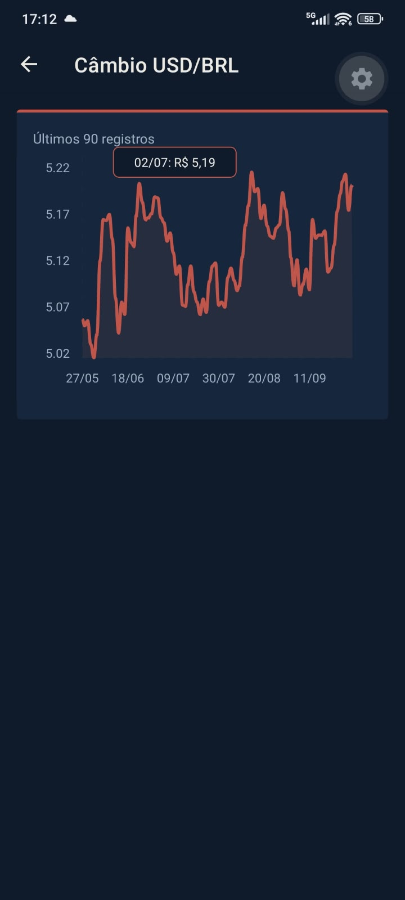
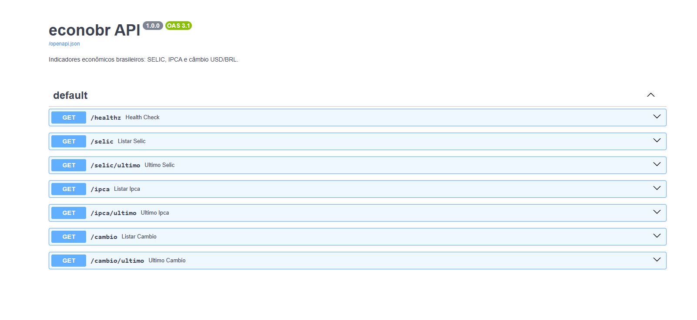

# docs

[← voltar ao README principal](../README.md)
 
Diagramas e capturas de tela do projeto, para referência e documentação visual.
 
## Arquitetura
 

 
Fluxo de produção: API do Banco Central → ETL (Python) → Postgres (Supabase) → API REST (FastAPI, no Render) → Dashboard Web (Vercel) e App Mobile (Expo), em paralelo.
O ambiente local de desenvolvimento segue a mesma lógica, trocando Supabase por SQL Server em container Docker, ver o README principal para os dois fluxos completos.
 
## Capturas de tela
 
Todas em [`screenshots/`](./screenshots).
 
### Dashboard web
 
| Resumo + gráficos | SELIC | IPCA | Câmbio |
|---|---|---|---|
|  |  |  |  |
 
### App mobile
 
| Splash | Lista (Home) | SELIC | IPCA | Câmbio |
|---|---|---|---|---|
|  |  |  |  |  |
 
### API
 

